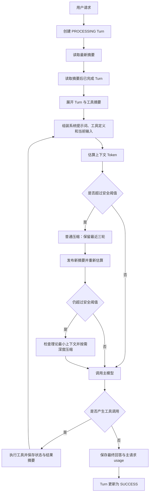

# Agent Conversation Memory Persistence and Context Compaction Implementation Plan

> **For Claude:** REQUIRED SUB-SKILL: Use superpowers:executing-plans to implement this plan task-by-task.

**Goal:** 将当前仅支持单机内存和固定三轮淘汰的会话记忆，升级为基于 MySQL 的 Turn 级持久化、Usage 校准、Token 水位控制与两级摘要压缩方案。

**Architecture:** 原始对话以完整问答轮次 `Turn` 作为事实源持久化，工具调用作为 Turn 子记录，
摘要作为独立派生数据按轮次范围版本化。每次模型调用前组装系统提示词、工具定义、最新摘要、
摘要后完整 Turn 和当前轮次，通过安全阈值、硬限制和两级压缩控制上下文；主请求与压缩请求的 usage 分开记录。

**Tech Stack:** Java 21、Spring Boot 3.3、Spring WebFlux、MyBatis、MySQL、FastJSON、Lombok、JUnit 5、Reactor Test

---

## 1. 设计结论

第一版采用以下最小可用方案：

1. 使用 MySQL 持久化，不引入长期记忆、向量数据库和独立 Tokenizer 服务。
2. 数据库业务主单位是一轮完整问答 `Turn`，不是单条协议消息。
3. 每个 Turn 全量保存用户界面可见的用户输入和助手最终回答。
4. 工具调用作为 Turn 子记录，只保存必要参数、状态、结果摘要、错误码和链路标识，不保存完整大结果。
5. 原始 Turn 永远是事实源；摘要单独存储，不作为普通消息展示，也不能替代原始 Turn。
6. 正常路径通过历史统计系数估算 Token，成功请求返回的 usage 用于校准；条件满足时可作为下一轮增量估算锚点。
7. 达到安全阈值后批量压缩较老 Turn，至少保留最近三轮完整对话，避免第四轮开始每轮压缩。
8. 第一次压缩后仍超出安全阈值时，先判断理论最小上下文，再决定是否执行二次深度压缩。
9. 二次压缩后请求成功，向前端返回 `RESET_RECOMMENDED`，提示用户后续开启新会话。
10. 每次 Agent 模型推理前均重新检查上下文预算，不能只在 HTTP 请求刚进入时检查一次。

本计划替代当前 `ConversationMemoryService` 中“超过三轮立即逐轮摘要”的策略，但保留
`docs/plans/2026-08-21-ordered-agent-conversation-memory.md` 已确定的工具调用协议顺序。

## 2. 范围与非目标

### 2.1 本期范围

- Turn、工具调用、摘要和模型 usage 的 MySQL 持久化。
- 最新摘要及其覆盖范围管理。
- Token 估算、usage 校准和上下文分区统计。
- 普通压缩和深度压缩。
- 上下文超限异常分流及用户提示。
- 同一会话并发、请求幂等和摘要乐观锁。
- 基础监控指标和可追踪日志。

### 2.2 本期非目标

- 不建设跨会话长期记忆。
- 不建设向量检索和语义召回。
- 不保存模型隐藏推理过程。
- 不保存完整工具大结果；需要排障时仅保存受控引用或 `traceId`。
- 不提供中断后从 ReAct 工具步骤中间恢复；进程异常时将当前 Turn 标记失败，由用户重试。
- 不在第一版引入独立 Tokenizer 微服务。

## 3. 标识语义与术语

必须先统一当前代码中的标识语义：

| 名称 | 当前代码语义 | 本设计用途 |
|---|---|---|
| `sessionId` | 多轮会话标识 | 会话业务标识，与 `userId` 共同定位会话 |
| `taskId` | 单次请求链路标识 | Turn 幂等键和全链路追踪键 |
| `turnNo` | 当前尚无 | 会话内从 1 开始连续递增的轮次号 |
| `toolCallId` | 模型生成的工具调用 ID | 关联工具请求与工具结果 |
| `summaryVersion` | 当前只有内存版本 | 会话摘要的追加版本号 |
| `contextVersion` | 当前尚无 | 系统提示词、工具定义、模型或摘要变化后的上下文版本 |

如果上游实际将 `taskId` 作为跨轮稳定会话 ID，实施前必须统一接口语义；不能同时使用
`taskId` 和 `sessionId` 表示会话。

文档中的关键术语：

- **Turn**：一次用户输入开始，到助手最终显式回答结束的完整业务轮次。
- **协议消息**：发送给模型的 `developer/user/assistant/tool` 消息块。
- **摘要覆盖范围**：摘要已归纳的连续、已完成 Turn 区间。
- **主请求**：用于 Agent 决策、工具选择或生成最终回答的模型调用。
- **压缩请求**：专门生成会话摘要的模型调用。
- **安全阈值**：预留估算误差后的主请求输入上限。
- **硬限制**：模型上下文窗口扣除最大输出 Token 后的输入上限。

## 4. 总体架构



系统分为五个职责边界：

1. **会话持久化层**：Turn、工具调用、摘要和 usage 的查询与短事务更新。
2. **上下文组装层**：把 Turn 聚合展开为模型协议消息。
3. **Token 预算层**：估算各组成部分 Token，划分安全区、风险区和拒绝区。
4. **摘要压缩层**：生成并发布普通摘要或深度摘要。
5. **Agent 执行层**：每次模型推理前调用预算层，完成工具循环与最终回答。

## 5. 数据持久化设计

### 5.1 存储关系

```text
agent_conversation
├── conversation_turn
│   └── turn_tool_call
├── conversation_summary
└── model_call_record
```

MySQL 不保存每轮重复拼装后的完整模型上下文，也不重复保存 System Prompt 和工具定义正文；
调用记录只保存对应版本号和分段 Token。

### 5.2 会话表 `agent_conversation`

| 字段 | 类型建议 | 说明 |
|---|---|---|
| `id` | `BIGINT UNSIGNED` | 主键 |
| `user_id` | `VARCHAR(64)` | 用户标识 |
| `session_id` | `VARCHAR(128)` | 多轮会话标识 |
| `status` | `TINYINT UNSIGNED` | `ACTIVE/CLOSED/ARCHIVED` |
| `context_status` | `TINYINT UNSIGNED` | `NORMAL/NEAR_LIMIT/RESET_RECOMMENDED/EXCEEDED` |
| `latest_turn_no` | `INT UNSIGNED` | 已分配的最大轮次号 |
| `latest_summary_id` | `BIGINT UNSIGNED` | 最新有效摘要 ID，可空 |
| `latest_summary_version` | `INT UNSIGNED` | 最新摘要版本 |
| `context_version` | `INT UNSIGNED` | 模型、提示词、工具或摘要变化后的语义版本 |
| `lock_version` | `INT UNSIGNED` | 通用并发更新乐观锁版本 |
| `execution_owner` | `VARCHAR(128)` | 当前会话执行租约持有者，可空 |
| `execution_expire_time` | `DATETIME(3)` | 执行租约过期时间，可空 |
| `model_name` | `VARCHAR(64)` | 当前主模型 |
| `system_prompt_version` | `VARCHAR(64)` | 系统提示词版本 |
| `tool_definition_version` | `VARCHAR(64)` | 工具定义版本 |
| `create_time` | `DATETIME(3)` | 创建时间 |
| `update_time` | `DATETIME(3)` | 更新时间 |

索引：

```text
唯一索引：(user_id(64), session_id(128))
普通索引：(status, update_time)
```

### 5.3 轮次表 `conversation_turn`

一条记录代表一轮完整问答，而不是一条模型消息。

| 字段 | 类型建议 | 说明 |
|---|---|---|
| `id` | `BIGINT UNSIGNED` | 主键 |
| `conversation_id` | `BIGINT UNSIGNED` | 所属会话 |
| `turn_no` | `INT UNSIGNED` | 会话内轮次号 |
| `task_id` | `VARCHAR(128)` | 单次请求幂等和追踪标识 |
| `user_content` | `MEDIUMTEXT` | 用户界面显式输入 |
| `assistant_content` | `MEDIUMTEXT` | 助手最终显式回答，执行中可空 |
| `status` | `TINYINT UNSIGNED` | `PROCESSING/SUCCESS/FAILED/CANCELLED` |
| `compression_level` | `TINYINT UNSIGNED` | `NONE/NORMAL/DEEP` |
| `user_token_estimate` | `INT UNSIGNED` | 用户内容估算 Token |
| `assistant_token_estimate` | `INT UNSIGNED` | 实际保存回答估算 Token |
| `final_model_call_id` | `BIGINT UNSIGNED` | 最终成功主请求记录 ID |
| `error_code` | `VARCHAR(64)` | 失败错误码 |
| `error_message` | `VARCHAR(1024)` | 脱敏后的失败摘要 |
| `finish_time` | `DATETIME(3)` | 终态时间 |
| `create_time` | `DATETIME(3)` | 创建时间 |
| `update_time` | `DATETIME(3)` | 更新时间 |

索引：

```text
唯一索引：(conversation_id, turn_no)
唯一索引：(task_id(128))
普通索引：(conversation_id, status, turn_no)
普通索引：(status, update_time)
```

Turn 生命周期：

```text
PROCESSING → SUCCESS
PROCESSING → FAILED
PROCESSING → CANCELLED
```

Turn 进入终态后，用户输入和助手回答不再修改。修订历史如有业务需要，应追加版本记录，
不能直接覆盖事实源。

摘要覆盖按连续 `turnNo` 推进：

- `PROCESSING` Turn 绝不能被摘要跨越。
- `SUCCESS` Turn 使用用户输入、工具摘要和助手最终回答参与摘要。
- `FAILED/CANCELLED` Turn 以“用户输入 + 终态 + 脱敏错误码”的规范化记录参与覆盖，
  不将失败过程伪装为模型事实，也不会永久阻塞摘要终点。
- `minimumRecentTurns` 按最近成功 Turn 数量计算；夹在其间的失败或取消 Turn 一并保留或覆盖。

服务启动和定时恢复任务需要扫描超时未更新的 `PROCESSING` Turn，将其转换为明确失败终态；
关联的 `REQUESTING` 模型调用及 `PENDING/RUNNING` 工具调用同步转换为 `TIMEOUT` 或 `CANCELLED`。

### 5.4 工具调用表 `turn_tool_call`

| 字段 | 类型建议 | 说明 |
|---|---|---|
| `id` | `BIGINT UNSIGNED` | 主键 |
| `turn_id` | `BIGINT UNSIGNED` | 所属 Turn |
| `agent_step_no` | `INT UNSIGNED` | 本轮第几次 Agent 推理 |
| `call_no` | `INT UNSIGNED` | 当前步骤内调用顺序 |
| `call_id` | `VARCHAR(128)` | 模型工具调用 ID |
| `tool_name` | `VARCHAR(128)` | 工具名称 |
| `arguments_content` | `TEXT` | 必要且脱敏后的原始参数字符串 |
| `status` | `TINYINT UNSIGNED` | `PENDING/RUNNING/SUCCESS/FAILED/TIMEOUT/CANCELLED/SKIPPED` |
| `result_summary` | `TEXT` | 会影响后续对话的结果摘要 |
| `result_reference` | `VARCHAR(256)` | 可选 trace 或对象存储引用 |
| `error_code` | `VARCHAR(64)` | 工具错误码 |
| `error_message` | `VARCHAR(1024)` | 脱敏后的错误摘要 |
| `latency_millis` | `BIGINT UNSIGNED` | 调用耗时 |
| `start_time` | `DATETIME(3)` | 开始时间 |
| `finish_time` | `DATETIME(3)` | 结束时间 |
| `create_time` | `DATETIME(3)` | 创建时间 |
| `update_time` | `DATETIME(3)` | 更新时间 |

索引：

```text
唯一索引：(turn_id, agent_step_no, call_no)
唯一索引：(turn_id, agent_step_no, call_id(128))
普通索引：(turn_id, status)
普通索引：(status, update_time)
```

完整工具结果仅在当前 ReAct 循环的进程内存中使用，并继续受现有
`agent.llm.observation-max-chars` 限制。持久化的 `result_summary` 不能只写“调用成功”，
必须包含后续对话可能引用的关键业务事实。

工具参数使用脱敏后的原始字符串保存，避免 MySQL JSON 重新格式化键顺序、空白或数字表现形式后，
无法确定性重建协议消息和计算前缀指纹。确有结构查询需求时，可以另加 JSON 派生列，但原始字符串仍是回放依据。

### 5.5 摘要表 `conversation_summary`

| 字段 | 类型建议 | 说明 |
|---|---|---|
| `id` | `BIGINT UNSIGNED` | 主键 |
| `conversation_id` | `BIGINT UNSIGNED` | 所属会话 |
| `summary_version` | `INT UNSIGNED` | 摘要版本 |
| `previous_summary_id` | `BIGINT UNSIGNED` | 来源摘要 ID，可空 |
| `covered_start_turn_no` | `INT UNSIGNED` | 覆盖起始轮次 |
| `covered_end_turn_no` | `INT UNSIGNED` | 覆盖结束轮次 |
| `summary_content` | `MEDIUMTEXT` | 摘要正文 |
| `summary_token_estimate` | `INT UNSIGNED` | 摘要估算 Token |
| `compression_level` | `TINYINT UNSIGNED` | `NORMAL/DEEP` |
| `model_call_id` | `BIGINT UNSIGNED` | 对应压缩调用记录 |
| `model_name` | `VARCHAR(64)` | 压缩模型 |
| `prompt_version` | `VARCHAR(64)` | 压缩提示词版本 |
| `status` | `TINYINT UNSIGNED` | `PUBLISHED/SUPERSEDED/INVALID` |
| `create_time` | `DATETIME(3)` | 创建时间 |
| `update_time` | `DATETIME(3)` | 更新时间 |

索引：

```text
唯一索引：(conversation_id, summary_version)
普通索引：(conversation_id, covered_end_turn_no)
普通索引：(conversation_id, status, summary_version)
```

摘要必须满足以下不变量：

- 覆盖范围必须连续，覆盖终点不得回退；普通压缩向前推进，深度压缩可以保持同一覆盖终点。
- 只能覆盖已经完成的完整 Turn。
- 不能从工具调用链中间切断。
- 摘要失败、为空、格式非法或超长时不能发布。
- 摘要正文、覆盖范围和版本指针必须在同一个短事务内生效。
- 深度压缩允许在覆盖终点不变时生成更短的新版本。

### 5.6 模型调用表 `model_call_record`

一个 Turn 可能包含多次主模型调用，因此 usage 必须按模型调用保存，而不是只保存在 Turn 上。

| 字段 | 类型建议 | 说明 |
|---|---|---|
| `id` | `BIGINT UNSIGNED` | 主键 |
| `conversation_id` | `BIGINT UNSIGNED` | 所属会话 |
| `turn_id` | `BIGINT UNSIGNED` | 所属 Turn，压缩请求可空 |
| `task_id` | `VARCHAR(128)` | 请求追踪标识 |
| `provider_request_id` | `VARCHAR(128)` | 模型供应方请求 ID，可空 |
| `call_type` | `TINYINT UNSIGNED` | `MAIN/COMPRESSION` |
| `agent_step_no` | `INT UNSIGNED` | Turn 内主模型调用序号，压缩请求可空 |
| `status` | `TINYINT UNSIGNED` | `REQUESTING/SUCCESS/FAILED/TIMEOUT/CANCELLED` |
| `apply_status` | `TINYINT UNSIGNED` | `NOT_APPLICABLE/PENDING/APPLIED/DISCARDED` |
| `model_name` | `VARCHAR(64)` | 模型名称 |
| `estimated_input_tokens` | `INT UNSIGNED` | 调用前估算值 |
| `input_tokens` | `INT UNSIGNED` | usage 实际输入 Token，可空 |
| `output_tokens` | `INT UNSIGNED` | usage 实际输出 Token，可空 |
| `reasoning_tokens` | `INT UNSIGNED` | 隐藏推理 Token，可空 |
| `cached_input_tokens` | `INT UNSIGNED` | 缓存命中 Token，可空 |
| `total_tokens` | `INT UNSIGNED` | 总 Token，可空 |
| `context_window` | `INT UNSIGNED` | 本次上下文窗口 |
| `max_output_tokens` | `INT UNSIGNED` | 本次最大输出预算 |
| `history_end_turn_no` | `INT UNSIGNED` | 本次完整回放的最后一个历史 Turn，可空 |
| `compression_end_turn_no` | `INT UNSIGNED` | 压缩请求计划覆盖的最后一个 Turn，可空 |
| `is_anchor_reusable` | `TINYINT UNSIGNED` | usage 能否作为增量估算锚点 |
| `summary_version` | `INT UNSIGNED` | 使用的摘要版本 |
| `context_version` | `INT UNSIGNED` | 使用的上下文版本 |
| `context_fingerprint` | `CHAR(64)` | 可复用输入前缀指纹 |
| `system_prompt_version` | `VARCHAR(64)` | 系统提示词版本 |
| `tool_definition_version` | `VARCHAR(64)` | 工具定义版本 |
| `compression_level` | `TINYINT UNSIGNED` | 当前压缩等级 |
| `latency_millis` | `BIGINT UNSIGNED` | 模型耗时 |
| `error_code` | `VARCHAR(64)` | 错误码 |
| `error_message` | `VARCHAR(1024)` | 脱敏后的错误摘要 |
| `create_time` | `DATETIME(3)` | 创建时间 |
| `update_time` | `DATETIME(3)` | 更新时间 |

索引：

```text
普通索引：(task_id(128), call_type, agent_step_no, id)
普通索引：(turn_id, call_type, agent_step_no, id)
普通索引：(conversation_id, call_type, status, id)
普通索引：(status, update_time)
```

数据库字段 `is_anchor_reusable` 映射到 Java 属性 `anchorReusable`，POJO 布尔属性不使用 `is` 前缀。

主请求与压缩请求 usage 必须分开：

- `MAIN` usage 用于主请求成本、误差校准和满足条件时的下一轮估算锚点。
- `COMPRESSION` usage 只用于压缩成本和压缩率统计，不能作为下一次主请求基线。
- usage 缺失必须保存为 `NULL`，不能用 `0` 伪装成模型实际返回值。
- 压缩调用成功后先独立保存 usage；摘要 CAS 冲突时将 `apply_status` 标记为 `DISCARDED`，
  不能因摘要未发布而回滚已经发生的模型成本记录。

## 6. Turn 与模型消息的确定性转换

数据库按 Turn 存储，模型仍然需要标准协议消息。读取 Turn 后按原始顺序展开：

```text
user：用户输入
assistant：该 Agent 步骤产生的 tool_calls
tool：每个 tool_call 对应的状态和结果摘要
assistant：最终显式回答
```

没有工具调用时只展开：

```text
user：用户输入
assistant：最终显式回答
```

规则：

1. 根据 `agentStepNo` 和 `callNo` 恢复工具调用顺序。
2. 每个 `assistant.tool_calls` 后必须跟随相同 `callId` 的 `tool` 结果。
3. 工具结果只回放状态和 `resultSummary`，不能回放不存在的完整结果。
4. 最新摘要作为内部 `developer` 消息注入，不保存为普通 `assistant` 消息。
5. 当前 `PROCESSING` Turn 的用户输入只添加一次，避免“数据库已读到一次、请求对象又追加一次”。
6. 带工具调用的中间模型步骤不向前端输出正文，也不并入最终 `assistantContent`；只有无后续工具调用的
   最终步骤文本作为用户可见回答。中间步骤如需提示，只转换为不持久化的状态事件。

最终上下文：

```text
System/Developer Prompt
+ Tool Definitions
+ Latest Summary
+ Completed Turns after summaryEndTurnNo
+ Current Turn working messages
```

AGENT 模式以 MySQL 为唯一历史事实源，`ChatRequest.history` 不再与数据库历史共同拼接。
第一版直接忽略该字段并记录迁移指标；如需导入旧客户端历史，应使用单独的一次性迁移流程，
不能在正常请求路径隐式导入。

当前 `pageData` 属于临时页面上下文，不写入 Turn。它必须计入本轮预算，但包含 `pageData` 的模型调用
默认将 `anchorReusable` 设为 false，因为下一轮无法从数据库重建完全相同的输入前缀。

## 7. Token 估算与 usage 校准

### 7.1 主请求预算

```text
hardInputLimit = contextWindow - maxOutputTokens

safeInputLimit = floor(hardInputLimit × safeInputRatio)

safetyMarginTokens = hardInputLimit - safeInputLimit

compressionTargetLimit = floor(hardInputLimit × compressionTargetRatio)
```

`maxCompressionSummaryTokens` 不从主请求窗口再次扣除，它只属于压缩请求预算。

上述公式成立的前提是实际模型请求明确设置输出上限。`AgentLlmClient` 必须接收调用选项对象，
将 MAIN、NORMAL COMPRESSION 和 DEEP COMPRESSION 对应的 `maxOutputTokens` 写入网关请求；
不能只在本地计算预算而不限制模型输出。

完整输入估算：

```text
estimatedInputTokens
= systemPromptTokens
+ toolDefinitionTokens
+ summaryTokens
+ uncoveredTurnTokens
+ currentTurnTokens
+ protocolOverheadTokens
```

上下文区域：

```text
estimatedInputTokens <= safeInputLimit
→ SAFE，可直接请求

safeInputLimit < estimatedInputTokens <= hardInputLimit
→ RISK；初始阶段先压缩，仅在深度压缩后或已无历史可压缩时允许尝试请求

estimatedInputTokens > hardInputLimit
→ REJECT，必须压缩或拒绝
```

### 7.2 初始估算方法

第一版不部署独立 Tokenizer。每个模型按历史样本维护估算系数：

```text
baseEstimate
= ceil(utf8ByteCount × tokenPerByteFactor)
+ messageCount × messageProtocolOverhead

estimatedTokens
= ceil(baseEstimate × calibrationFactor)
```

要求：

- `tokenPerByteFactor` 和 `calibrationFactor` 按模型版本分别配置。
- 初始系数来自离线真实样本，不直接采用英文“字符数除以 4”的经验。
- 安全系数使用历史低估误差的 P95 或更高分位，而不是简单平均值。
- System Prompt、工具定义和稳定摘要的估算结果可以按版本缓存。
- Turn 完成后保存用户、助手和工具摘要的估算值，后续只做累加。

### 7.3 usage 的使用方式

成功调用后保存模型返回的：

```text
inputTokens
outputTokens
reasoningTokens（如果网关提供）
cachedInputTokens（如果网关提供）
```

usage 是调用后的实际值，主要用于：

1. 校准统计估算系数。
2. 监控估算误差和模型成本。
3. 在上下文结构完全一致时，作为下一轮增量估算锚点。

增量估算公式：

```text
nextInputEstimate
= lastReusableMainInputTokens
+ anchor 后新增且下一轮会实际回放的内容估算值
+ 新增协议开销
```

`contextFingerprint` 只校验锚点对应的可复用输入前缀，不包含下一轮新追加的助手回答和用户输入。
计算时应对模型、提示词、当前用户实际可用的排序后工具 Schema、摘要、截至 `historyEndTurnNo` 的历史，
以及当前 `turnId/agentStepNo` 已包含的内容生成哈希。下一轮先重建该前缀并验证一致，
再追加最终助手回答和新用户输入的估算值。

只有满足以下条件，usage 锚点才可复用：

- 模型、System Prompt、工具定义和摘要版本均未变化。
- 历史 Turn 没有被修改或重新压缩。
- 上一轮真实模型输入与下一轮根据数据库重建的内容一致。
- 上一次主请求成功且返回完整 usage。
- `contextFingerprint` 校验一致。

以下情况立即使锚点失效，并重新估算完整上下文：

- 普通压缩或深度压缩。
- 模型、提示词或工具版本变化。
- 上一轮请求失败或 usage 缺失。
- 上一轮调用包含完整工具结果，而数据库只保存工具摘要。
- `outputTokens` 包含不会回放的隐藏推理内容。

特别说明：当前 Agent 一轮可能经历“模型 → 工具 → 模型”。工具执行时模型使用的是截断后的完整观察结果，
而后续数据库回放只有结果摘要，因此发生工具调用的 Turn 默认不复用上一轮 inputTokens 锚点，
只将实际 usage 用于估算系数校准。

## 8. 两级压缩算法

### 8.1 压缩触发原则

不要等到硬限制才压缩。建议初始配置：

```text
safeInputRatio = 70%
compressionTargetRatio = 45%～50%
minimumRecentTurns = 3
```

最终阈值必须按实际模型 usage 误差和线上压测调整，配置值不能写死在代码中。
所有比例均以 `hardInputLimit` 为基数。普通压缩循环执行到预计输入不高于
`compressionTargetLimit`，或者已经没有普通压缩候选 Turn。

### 8.2 普通压缩

选择范围：

```text
旧摘要
+ 摘要覆盖终点之后
+ 最近三轮完整对话之前
+ 连续且已完成的较老 Turn
```

压缩输出只能是一份新摘要，最近三轮继续以原始 Turn 保留，不由模型重新生成。

```text
compressionInput
= compressionPrompt
+ oldSummary
+ eligibleOldTurns

compressionInput
+ maxCompressionSummaryTokens
+ compressionSafetyMargin
<= compressionModelContextWindow
```

如果待压缩内容一次放不进压缩模型，按完整 Turn 选取能够放入的最老一批，分批推进摘要；
不能从 Turn 或工具调用链中间截断。

普通压缩应选择足够多的较老 Turn，使预计压缩后上下文尽量下降到 `compressionTargetRatio`，
而不是刚刚低于安全阈值；这样才能避免下一轮再次触发压缩。

压缩模型返回后，先独立完成压缩调用记录及 usage，再使用短事务发布摘要：

1. 插入新摘要版本。
2. 将旧摘要标记为 `SUPERSEDED`。
3. 更新最新摘要 ID、版本、覆盖终点和 `contextVersion`。
4. 将压缩调用 `applyStatus` 标记为 `APPLIED`。
5. 重新组装并重新估算主请求，旧 usage 锚点立即失效。

如果摘要发布 CAS 冲突，模型调用和 usage 仍保留，只将 `applyStatus` 标记为 `DISCARDED`。

### 8.3 深度压缩

第一次压缩后仍超过安全阈值，先计算理论最小上下文：

```text
minimumRequiredTokens
= systemPromptTokens
+ requiredToolTokens
+ currentUserAndPageContextTokens
+ indispensableCurrentTurnToolTokens
+ currentTurnProtocolOverhead
+ optionalMinimumSummaryTokens
```

其中 `indispensableCurrentTurnToolTokens` 包含当前 Agent 步骤已经产生、即使裁剪后仍必须保留的
工具调用协议和工具结果。预算使用的 `requiredToolTokens` 必须来自本步骤实际发送的不可变工具定义列表。

判断：

- `minimumRequiredTokens > hardInputLimit`：压缩无意义，不调用压缩模型，直接返回明确错误。
- `minimumRequiredTokens <= hardInputLimit`：允许将当前输入之前的全部历史压缩成极简摘要。

如果此时已经没有可压缩历史，则不调用压缩模型：处于 RISK 区就直接进行一次风险请求，
超过硬限制则按最小上下文组成分类返回错误。

深度压缩输入是“最新摘要 + 当前用户输入之前尚未覆盖的全部终态 Turn”。新摘要的
`coveredEndTurnNo` 更新为这些 Turn 的最后一个轮次；只有没有新增 Turn、仅缩短现有摘要时，覆盖终点保持不变。

深度压缩后：

```text
estimatedInputTokens <= safeInputLimit
→ 正常请求

safeInputLimit < estimatedInputTokens <= hardInputLimit
→ 风险请求；成功后返回 RESET_RECOMMENDED

estimatedInputTokens > hardInputLimit
→ 不调用主模型，返回上下文过长
```

已经完成深度压缩后，模型仍返回 `contextLengthExceeded` 时不再进行第三次压缩。

### 8.4 固定摘要结构

摘要提示词要求输出以下固定结构：

```text
当前目标：
已确认事实：
重要约束：
已作出决定：
工具确认的信息：
未解决问题：
当前进度：
```

摘要规则：

- 只能归纳原文，不得补充推断事实。
- 冲突信息必须明确保留冲突，或注明用户最新明确表述。
- 名称、代码、金额、日期、状态等关键字段尽量原样保留。
- 摘要为空、超长或缺少必需结构时不能发布。
- 连续多次增量摘要后，可按配置从原始 Turn 重新生成阶段摘要，降低“摘要的摘要”漂移。

### 8.5 核心伪代码

```java
/**
 * 在调用模型前准备受控上下文。
 */
Mono<PreparedContext> prepareContext(TurnRequest request) {
    return loadConversationSnapshot(request)
            .flatMap(snapshot -> assembleAndEstimate(snapshot, request))
            .flatMap(context -> {
                if (context.isWithinSafeLimit()) {
                    return Mono.just(context);
                }
                return compactNormally(context)
                        .flatMap(this::reloadAndEstimate)
                        .flatMap(compacted -> {
                            if (compacted.isWithinSafeLimit()) {
                                return Mono.just(compacted);
                            }
                            if (compacted.minimumRequiredTokensExceedHardLimit()) {
                                return Mono.error(classifyMinimumContextOverflow(compacted));
                            }
                            return compactDeeply(compacted)
                                    .flatMap(this::reloadAndEstimate)
                                    .flatMap(this::acceptRiskOrReject);
                        });
            });
}
```

实际实现不能捕获笼统的 `Exception`，必须针对数据库、下游超时、上下文超限和版本冲突分别处理。

## 9. Agent 工具循环中的预算检查

上下文预算检查必须放在 `AgentLoop.executeStep` 每次调用 `AgentLlmClient.chat` 之前：

```text
第一次模型调用前检查
→ 执行工具
→ 将截断后的完整工具观察结果加入当前工作上下文
→ 第二次模型调用前再次检查
```

注意：

- 当前 Turn 内工具完整结果可能导致上下文突然超过限制。
- 当前 Turn 尚未完成，不能把它写入历史摘要来解决问题。
- 优先裁剪工具观察结果、保留必要字段，必要时返回 `TOOL_RESULT_TOO_LARGE`。
- 工具结果持久化摘要和当前轮模型观察结果是两个不同对象，不能混用。
- 工具调用有副作用时必须依赖 `callId` 和业务幂等键防止重复执行。
- 每个 Agent 步骤只生成一次不可变的实际工具定义列表；Token 预算和 `AgentLlmClient` 必须使用同一对象，
  并将排序后的实际工具 Schema 纳入上下文前缀指纹，不能在预算和发送阶段分别重新获取权限工具。
- 每一步的模型文本先缓冲；确认该步骤没有工具调用后才作为最终正文发送和持久化。

## 10. 状态、错误与用户提示

### 10.1 压缩等级

```text
NONE：未压缩
NORMAL：执行过普通压缩
DEEP：执行过深度压缩
```

用户提示由服务端返回结构化状态，不拼接进模型回答：

```json
{
  "conversationStatus": "RESET_RECOMMENDED",
  "compressionLevel": "DEEP",
  "userMessage": "当前对话较长，建议完成当前问题后开启新对话"
}
```

第一版可在 `COMPLETE` 事件前额外发送一个 `STATUS` 事件；后续再根据前端协议升级为独立完成负载。
发生 DEEP 压缩的本次成功响应发送一次提示；SSE 重连是否重复展示由前端事件幂等处理，
第一版不承诺跨请求“某摘要版本只提示一次”。

### 10.2 错误分流

| 错误码 | 判断依据 | 用户处理 |
|---|---|---|
| `CURRENT_INPUT_TOO_LARGE` | 当前输入、附件或页面上下文本身超限 | 缩短输入或减少附件，新开会话无效 |
| `HISTORY_TOO_LONG` | 历史压缩后仍无法容纳 | 建议开启新会话 |
| `STATIC_CONTEXT_TOO_LARGE` | System Prompt 或必要工具定义过大 | 服务端配置问题，不归责用户 |
| `TOOL_RESULT_TOO_LARGE` | 当前轮工具观察结果超限 | 缩小工具结果或优化工具摘要 |
| `ESTIMATION_INACCURATE` | 估算可容纳但模型实际报超限 | 记录误差并执行一次受控降级 |
| `COMPRESSION_FAILED` | 压缩超时、空摘要或格式错误 | 保留旧摘要，不推进覆盖终点 |
| `CONCURRENT_CONTEXT_UPDATE` | 摘要 CAS 多次冲突且重评失败 | 返回可重试的服务端并发错误 |
| `CONTEXT_LIMIT_EXCEEDED` | 深度压缩后仍超过硬限制 | 返回明确上下文错误 |

限流、鉴权、超时和普通下游错误不能错误映射为“对话过长”。

## 11. 事务、并发与幂等

### 11.1 创建 Turn

使用短事务：

1. 根据 `(userId, sessionId)` 获取或创建会话。
2. 通过 `lockVersion` 条件更新原子递增 `latestTurnNo`；`contextVersion` 不参与普通轮次并发锁。
3. 使用 `taskId` 作为请求幂等键插入 `PROCESSING` Turn。
4. 提交事务后再调用模型，模型期间不持有数据库事务或行锁。

### 11.2 完成 Turn

主模型完成后使用短事务：

1. 更新最终主调用 usage 和状态。
2. 将助手最终显式回答写入 Turn。
3. 将 Turn 从 `PROCESSING` 条件更新为 `SUCCESS`。
4. 保存 `finalModelCallId` 和压缩等级。

状态条件更新失败说明重复回调或并发冲突，不能重复覆盖。

### 11.3 发布摘要

压缩模型调用在事务外执行：

1. 读取当前摘要版本和待压缩 Turn 快照。
2. 调用压缩模型。
3. 独立完成压缩 `model_call_record` 的状态和 usage 写入。
4. 开启短事务并再次检查 `latestSummaryId/latestSummaryVersion`。
5. 版本一致时插入新摘要、失效旧摘要、更新会话摘要指针，并把调用 `applyStatus` 标记为 `APPLIED`。
6. 版本冲突时将调用 `applyStatus` 标记为 `DISCARDED`，重载并有限次重新评估，不能覆盖较新的摘要。

### 11.4 同一会话并发

第一版使用 `agent_conversation` 上的执行租约实现同一 `(userId, sessionId)` 串行：通过条件更新写入
`executionOwner/executionExpireTime`，执行期间续租，并在 Reactor `doFinally` 中释放；进程崩溃后依靠过期时间恢复。
模型和工具调用期间不持有数据库事务或行锁。

重复 `taskId` 的处理固定为：

- 已有 Turn 为 `PROCESSING`：返回 `REQUEST_IN_PROGRESS`，不重复执行。
- 已有 Turn 为 `SUCCESS`：回放已保存的助手回答和完成事件。
- 已有 Turn 为 `FAILED/CANCELLED`：返回原终态；用户重试必须生成新的 `taskId`。

即使已串行，数据库仍必须保留：

- `taskId` 全局唯一约束。
- `(conversationId, turnNo)` 唯一约束。
- 摘要版本乐观校验。
- Turn 和工具状态条件更新。
- 工具有副作用时的业务幂等键。

## 12. 响应式与数据库边界

当前服务使用 Spring WebFlux，而 MyBatis/JDBC 是阻塞式调用。所有 DAO 调用必须离开 Reactor 事件循环，统一封装为：

```java
Mono.fromCallable(() -> conversationTurnMapper.selectByConversation(...))
        .subscribeOn(Schedulers.boundedElastic());
```

禁止在 Controller 或 AgentLoop 中直接调用 Mapper。推荐依赖方向：

```text
Web
→ Service / Agent Orchestrator
→ ConversationMemoryManager
→ dal/dao Mapper
```

涉及 Turn 与工具子记录、摘要与会话指针的多表写操作才使用 `@Transactional`；纯查询禁止添加事务。

## 13. 配置建议

在 `agent.llm` 下增加配置，所有数值都必须可按模型调整：

```yaml
agent:
  llm:
    model-name: "configured-model"
    context-window-tokens: 128000
    max-output-tokens: 4096
    safe-input-ratio: 0.70
    compression-target-ratio: 0.45
    minimum-recent-turns: 3
    compression-model-name: configured-model
    compression-context-window-tokens: 128000
    max-compression-summary-tokens: 2048
    max-deep-summary-tokens: 1024
    token-per-byte-factor: 0.50
    token-calibration-factor: 1.20
    summary-prompt-version: "v1.0.0"
```

以上仅为初始示例值，不代表生产最终值。上线前必须用真实模型、中文问答、英文、代码和工具调用样本校准。
第一版允许压缩模型与主模型相同，但仍使用独立配置，便于后续切换成本更低的压缩模型。

## 14. 隐私、保留与审计

- 用户、会话和任务查询必须做权限校验，不能只凭 `sessionId` 越权读取。
- 用户输入、助手回答、摘要和工具结果摘要按同一敏感等级管理。
- 工具参数、结果摘要和错误信息入库前必须脱敏。
- 日志只记录 ID、版本、Token 分段、状态和错误码，原则上不记录完整对话正文。
- 设定明确的数据保留周期；会话删除时同步删除 Turn、工具记录、摘要和外部引用。
- 摘要不是脱敏数据，也不能作为删除原文的自动依据。
- 不使用数据库外键，关联完整性和清理顺序由应用层保证。

## 15. 监控指标

至少记录：

- System Prompt、工具定义、摘要、历史 Turn、当前 Turn 的分段估算 Token。
- `estimatedInputTokens`、实际 `inputTokens` 和误差比例。
- SAFE、RISK、REJECT 区域请求数量。
- 普通压缩、深度压缩的次数、成功率、耗时和压缩率。
- `contextLengthExceeded`、压缩失败和摘要版本冲突次数。
- 工具结果截断次数和 `TOOL_RESULT_TOO_LARGE` 次数。
- `RESET_RECOMMENDED` 返回次数。
- MySQL 查询耗时、模型耗时和总请求耗时。

追踪关系分为两条：

```text
userId + sessionId → conversationId → turn / summary
taskId → turnId → modelCall / toolCall
```

某次模型调用通过 `summaryVersion` 记录它使用的摘要版本，摘要本身不从属于单个 `taskId`。

## 16. 验收标准

### 16.1 功能验收

- 无摘要、无历史时可正常完成第一轮。
- 数据库一条 Turn 对应一轮完整问答，工具调用以子记录关联。
- 摘要只覆盖连续、已完成 Turn，最近三轮默认保持原文。
- 普通压缩后不会在紧接着的每一轮重复压缩。
- 深度压缩后成功请求返回 `RESET_RECOMMENDED`。
- 当前输入本身超限时不调用压缩模型，返回 `CURRENT_INPUT_TOO_LARGE`。
- 主请求与压缩请求 usage 可区分查询。

### 16.2 边界验收

- 恰好等于安全阈值时允许请求。
- 恰好等于硬限制时允许风险请求。
- 超过硬限制时不直接调用主模型。
- 只有最近三轮且没有可压缩历史时行为正确。
- 压缩模型自身输入超限时按完整 Turn 分批处理。
- 当前工具结果过大时不会无限进入下一次模型调用。
- usage 缺失、包含隐藏推理 Token 或上下文指纹变化时不会错误复用锚点。

### 16.3 一致性验收

- 构造 100 轮对话并多次压缩，摘要覆盖范围无缺口、无回退。
- 两个并发压缩请求只允许一个摘要版本发布成功。
- 压缩超时、空摘要和写库失败时旧摘要继续有效。
- 同一进程内主模型成功后的 Turn 保存重试，不重复调用模型或重复执行有副作用工具。
- Turn、工具调用和模型调用可通过 taskId 关联；摘要通过 conversationId 和 summaryVersion 关联。

第一版不承诺“模型响应已返回但进程在 Turn 提交前崩溃”窗口的跨进程 exactly-once。
该场景由过期恢复任务将 Turn 标记失败，用户使用新 taskId 重试；有副作用工具仍必须提供业务幂等保证。

### 16.4 摘要质量验收

- 连续多次增量压缩后，名称、代码、金额、日期、状态和明确约束保持准确。
- 冲突信息不会被摘要擅自合并。
- 摘要不出现原始对话中不存在的事实。
- 格式缺失、空内容或超过最大长度的摘要不会被激活。

## 17. 当前代码差距

| 当前实现 | 目标实现 |
|---|---|
| `InMemoryConversationMemoryRepository` 单机内存保存 | MySQL 持久化，内存实现仅保留给测试 |
| `ConversationMemoryService` 超过三轮立即淘汰一轮 | Token 高水位触发批量压缩至低水位 |
| `ConversationSummaryService` 本地字符串拼接 | 调用压缩模型生成固定结构摘要 |
| `ConversationTurn` 保存 `List<AgentMessage>` | 持久层按 Turn 主记录和工具子记录保存，读取时展开协议消息 |
| `WebClientAgentLlmClient` 未采集 usage | 流结束解析并保存主请求或压缩请求 usage |
| 只在请求入口组装一次上下文 | 每个 Agent 模型步骤前重新预算 |
| 工具持久化只保存状态 | 保存脱敏参数、状态、关键结果摘要和 traceId |
| Agent 步骤文本立即流出并统一累加 | 中间工具步骤文本缓冲，只有最终无工具步骤成为显式回答 |
| `ChatRequest.history` 与服务端内存语义未统一 | AGENT 模式明确以 MySQL 为唯一历史事实源 |
| 无上下文错误分类 | 区分当前输入、历史、静态上下文、工具结果和估算偏差 |

## 18. 实施任务

### Task 1: 固化状态枚举和配置模型

**Files:**
- Create: `main/java/com/example/chat/common/enums/ConversationStatus.java`
- Create: `main/java/com/example/chat/common/enums/ConversationContextStatus.java`
- Create: `main/java/com/example/chat/common/enums/ConversationTurnStatus.java`
- Create: `main/java/com/example/chat/common/enums/ToolCallStatus.java`
- Create: `main/java/com/example/chat/common/enums/ModelCallType.java`
- Create: `main/java/com/example/chat/common/enums/ModelCallStatus.java`
- Create: `main/java/com/example/chat/common/enums/ModelCallApplyStatus.java`
- Create: `main/java/com/example/chat/common/enums/CompressionLevel.java`
- Create: `main/java/com/example/chat/common/enums/ContextZone.java`
- Create: `main/java/com/example/chat/common/enums/ContextErrorCode.java`
- Modify: `main/java/com/example/chat/config/AgentProperties.java`
- Modify: `main/resources/application.yml`
- Verify: `test/java/com/example/chat/config/AgentPropertiesTest.java`

**Risk Level:** Standard lightweight verification
**Why:** 主要是受限状态和值对象配置，但配置错误会影响后续所有预算判断。

**Step 1: Set verification path**

Skip strict TDD; use lightweight verification.

**Step 2: Prepare verification**

创建 `AgentPropertiesTest`，验证默认值、非法负数回退、比例边界和模型级配置绑定。

**Step 3: Write minimal implementation**

增加上下文窗口、输出预算、安全余量、压缩水位、摘要长度、近期轮数和估算系数配置；
所有枚举字段使用中文 Javadoc，不使用魔法数字。

**Step 4: Run chosen verification**

Run: `mvn -f ../pom.xml -Dtest=AgentPropertiesTest test`
Expected: PASS

**Step 5: Record a local checkpoint**

记录状态枚举、配置项和默认值验证结果，不执行 Git 操作。

### Task 2: 建立 MySQL 表结构和 MyBatis DAL

**Files:**
- Modify: `../pom.xml`
- Create: `main/resources/db/schema/agent_conversation_memory.sql`
- Create: `main/java/com/example/chat/dal/model/AgentConversationDO.java`
- Create: `main/java/com/example/chat/dal/model/ConversationTurnDO.java`
- Create: `main/java/com/example/chat/dal/model/TurnToolCallDO.java`
- Create: `main/java/com/example/chat/dal/model/ConversationSummaryDO.java`
- Create: `main/java/com/example/chat/dal/model/ModelCallRecordDO.java`
- Create: `main/java/com/example/chat/dal/dao/AgentConversationMapper.java`
- Create: `main/java/com/example/chat/dal/dao/ConversationTurnMapper.java`
- Create: `main/java/com/example/chat/dal/dao/TurnToolCallMapper.java`
- Create: `main/java/com/example/chat/dal/dao/ConversationSummaryMapper.java`
- Create: `main/java/com/example/chat/dal/dao/ModelCallRecordMapper.java`
- Create: `main/resources/mapper/AgentConversationMapper.xml`
- Create: `main/resources/mapper/ConversationTurnMapper.xml`
- Create: `main/resources/mapper/TurnToolCallMapper.xml`
- Create: `main/resources/mapper/ConversationSummaryMapper.xml`
- Create: `main/resources/mapper/ModelCallRecordMapper.xml`
- Verify: `test/java/com/example/chat/dal/dao/ConversationMapperContractTest.java`

**Risk Level:** High-risk TDD
**Why:** 数据模型、唯一约束和条件更新决定消息不丢失、摘要不越界及请求不重复。

**Step 1: Set verification path**

先建立 Mapper 合约测试，验证创建会话、幂等插入 Turn、按摘要终点查询、条件更新终态和摘要版本冲突。

**Step 2: Prepare verification**

先以 Mapper Mock 或测试数据库写出调用合约并看到测试失败；准备测试站 MySQL 时再补真实 DDL 集成验证。

**Step 3: Write minimal implementation**

为父级 `pom.xml` 增加公司批准版本的 MyBatis Spring Boot Starter、JDBC Starter 和 MySQL Driver；
DDL 严格使用小写单数表名、`id/create_time/update_time` 三字段、参数绑定和无外键设计。

**Step 4: Run chosen verification**

Run: `mvn -f ../pom.xml -Dtest=ConversationMapperContractTest test`
Expected: FAIL first then PASS

**Step 5: Record a local checkpoint**

记录 DDL、Mapper 合约和测试库验证结果；`../pom.xml` 位于当前工作区写入根之外，执行阶段如受限需先取得写权限。

### Task 3: 将内存聚合改造成 Turn 持久化模型

**Files:**
- Create: `main/java/com/example/chat/common/dto/agent/memory/ConversationSnapshotDTO.java`
- Create: `main/java/com/example/chat/common/dto/agent/memory/ConversationTurnDTO.java`
- Create: `main/java/com/example/chat/common/dto/agent/memory/ConversationToolCallDTO.java`
- Create: `main/java/com/example/chat/common/dto/agent/memory/ConversationSummaryDTO.java`
- Create: `main/java/com/example/chat/agent/memory/ConversationMemoryManager.java`
- Modify: `main/java/com/example/chat/agent/memory/ConversationMemoryService.java`
- Deprecate: `main/java/com/example/chat/agent/memory/ConversationMemoryRepository.java`
- Modify: `main/java/com/example/chat/agent/memory/InMemoryConversationMemoryRepository.java`
- Modify: `main/java/com/example/chat/agent/memory/ConversationTurn.java`
- Verify: `test/java/com/example/chat/agent/memory/ConversationMemoryManagerTest.java`
- Verify: `test/java/com/example/chat/agent/memory/ConversationMemoryServiceTest.java`

**Risk Level:** High-risk TDD
**Why:** 该任务改变会话事实源、Turn 生命周期和 WebFlux 到阻塞 DAO 的边界。

**Step 1: Set verification path**

先覆盖创建 PROCESSING Turn、按 `taskId` 幂等、完成 Turn、失败 Turn、读取摘要后 Turn 和工具子记录排序。

**Step 2: Prepare verification**

更新现有三轮内存测试，使其验证 Turn 聚合和摘要覆盖终点，而不是固定 `recentTurns.size()`。

**Step 3: Write minimal implementation**

`ConversationMemoryManager` 统一调用 Mapper，并使用 `Mono.fromCallable(...).subscribeOn(Schedulers.boundedElastic())`
隔离阻塞数据库访问；多表写使用短事务，模型调用期间不持有事务。

**Step 4: Run chosen verification**

Run: `mvn -f ../pom.xml -Dtest=ConversationMemoryManagerTest,ConversationMemoryServiceTest test`
Expected: FAIL first then PASS

**Step 5: Record a local checkpoint**

记录持久化聚合、响应式边界、幂等和状态迁移验证结果，不执行 Git 操作。

### Task 4: 实现 Turn 到模型协议消息的确定性展开

**Files:**
- Create: `main/java/com/example/chat/agent/memory/ConversationTurnReplayService.java`
- Modify: `main/java/com/example/chat/agent/prompt/AgentPromptFactory.java`
- Modify: `main/java/com/example/chat/agent/model/AgentMessage.java`
- Verify: `test/java/com/example/chat/agent/memory/ConversationTurnReplayServiceTest.java`
- Verify: `test/java/com/example/chat/agent/prompt/AgentPromptFactoryTest.java`

**Risk Level:** High-risk TDD
**Why:** 工具调用与结果必须严格配对并保持步骤顺序，否则模型协议无效。

**Step 1: Set verification path**

先断言无工具 Turn 和多步骤、多工具 Turn 均展开为合法的
`user → assistant.tool_calls → tool → assistant` 顺序。

**Step 2: Prepare verification**

增加当前 PROCESSING Turn 的用户输入不重复、摘要作为 developer 消息、工具结果仅使用持久化摘要的失败测试。
同时覆盖 `ChatRequest.history` 不与 MySQL 历史重复拼接，以及包含 `pageData` 的 Turn 不复用 usage 锚点。

**Step 3: Write minimal implementation**

按 `agentStepNo/callNo` 分组工具调用，恢复 `callId` 配对，最后追加助手显式回答；
`AgentPromptFactory` 只负责确定性组装，不访问数据库或执行压缩。

**Step 4: Run chosen verification**

Run: `mvn -f ../pom.xml -Dtest=ConversationTurnReplayServiceTest,AgentPromptFactoryTest test`
Expected: FAIL first then PASS

**Step 5: Record a local checkpoint**

记录 Turn 展开顺序、摘要角色和当前输入去重验证结果，不执行 Git 操作。

### Task 5: 采集流式模型 usage 和上下文错误

**Files:**
- Create: `main/java/com/example/chat/agent/model/AgentModelUsage.java`
- Create: `main/java/com/example/chat/agent/model/AgentModelRequest.java`
- Modify: `main/java/com/example/chat/agent/model/AgentModelResponse.java`
- Modify: `main/java/com/example/chat/agent/client/AgentLlmClient.java`
- Modify: `main/java/com/example/chat/agent/client/WebClientAgentLlmClient.java`
- Modify: `main/java/com/example/chat/common/exception/DownstreamException.java`
- Verify: `test/java/com/example/chat/agent/client/WebClientAgentLlmClientTest.java`

**Risk Level:** High-risk TDD
**Why:** usage 可能出现在流式终止事件中，解析丢失会导致估算基线和成本统计失真。

**Step 1: Set verification path**

先增加 SSE 用例，覆盖文本流、工具调用流、终止 usage、usage 缺失、上下文超限响应和隐藏推理 Token。

**Step 2: Prepare verification**

验证网关支持时请求 `stream_options.include_usage`；不支持时降级为 usage 缺失而不是解析失败。
分别断言 MAIN、普通压缩和深度压缩 payload 使用配置中的模型及输出上限。

**Step 3: Write minimal implementation**

将 `AgentLlmClient` 改为接收不可变 `AgentModelRequest`，其中包含模型名、调用类型、消息、实际工具定义、
上下文窗口和最大输出 Token；网关 payload 必须设置对应输出上限。增加 `USAGE` 响应类型或独立元数据事件，
解析 provider request ID、input/output/reasoning/cached Token，并将明确的上下文过长错误映射为具体错误类型。

**Step 4: Run chosen verification**

Run: `mvn -f ../pom.xml -Dtest=WebClientAgentLlmClientTest test`
Expected: FAIL first then PASS

**Step 5: Record a local checkpoint**

记录网关 usage 能力、缺失降级和错误映射验证结果，不执行 Git 操作。

### Task 6: 实现 Token 估算和上下文预算服务

**Files:**
- Create: `main/java/com/example/chat/agent/memory/ContextTokenEstimator.java`
- Create: `main/java/com/example/chat/agent/memory/ContextBudgetService.java`
- Create: `main/java/com/example/chat/common/dto/agent/memory/ContextTokenBreakdownDTO.java`
- Create: `main/java/com/example/chat/common/dto/agent/memory/ContextBudgetResultDTO.java`
- Verify: `test/java/com/example/chat/agent/memory/ContextTokenEstimatorTest.java`
- Verify: `test/java/com/example/chat/agent/memory/ContextBudgetServiceTest.java`

**Risk Level:** High-risk TDD
**Why:** 安全区、风险区、硬限制和 usage 锚点失效条件是整个压缩算法的核心边界。

**Step 1: Set verification path**

先写安全阈值等于、硬限制等于、超过硬限制、usage 锚点可复用和锚点失效测试。

**Step 2: Prepare verification**

增加中文、英文、代码、工具定义、摘要和协议开销的分段估算样本；明确 usage 缺失和隐藏推理场景。

**Step 3: Write minimal implementation**

实现基于 UTF-8 字节、模型系数和校准系数的估算；输出分段明细、上下文区域、理论最小上下文和指纹，
不在方法中写死阈值或模型参数。

**Step 4: Run chosen verification**

Run: `mvn -f ../pom.xml -Dtest=ContextTokenEstimatorTest,ContextBudgetServiceTest test`
Expected: FAIL first then PASS

**Step 5: Record a local checkpoint**

记录公式、边界值、锚点规则和误差样本验证结果，不执行 Git 操作。

### Task 7: 实现模型摘要与版本化发布

**Files:**
- Create: `main/java/com/example/chat/agent/memory/ConversationSummaryPromptFactory.java`
- Modify: `main/java/com/example/chat/agent/memory/ConversationSummaryService.java`
- Create: `main/java/com/example/chat/agent/memory/ConversationSummaryPublisher.java`
- Verify: `test/java/com/example/chat/agent/memory/ConversationSummaryServiceTest.java`
- Verify: `test/java/com/example/chat/agent/memory/ConversationSummaryPublisherTest.java`

**Risk Level:** High-risk TDD
**Why:** 摘要范围、摘要漂移和并发发布错误会造成长期且隐蔽的上下文丢失。

**Step 1: Set verification path**

先覆盖无旧摘要、增量摘要、分批摘要、深度摘要、空摘要、超长摘要、格式错误和版本冲突。

**Step 2: Prepare verification**

建立包含名称、金额、日期、冲突信息、约束和未解决问题的固定摘要样本，先验证当前字符串拼接实现不能满足要求。

**Step 3: Write minimal implementation**

压缩模型仅输出固定结构摘要；压缩调用及 usage 先独立落库，发布器再在短事务中执行版本 CAS、
插入新摘要和更新会话指针。CAS 冲突将本次结果标记为 `DISCARDED` 并触发有限次重载重评，
不直接向用户返回 `COMPRESSION_FAILED`。

**Step 4: Run chosen verification**

Run: `mvn -f ../pom.xml -Dtest=ConversationSummaryServiceTest,ConversationSummaryPublisherTest test`
Expected: FAIL first then PASS

**Step 5: Record a local checkpoint**

记录摘要格式、覆盖范围、分批压缩、失败回退和并发发布验证结果，不执行 Git 操作。

### Task 8: 接入两级压缩编排和每步骤预算检查

**Files:**
- Create: `main/java/com/example/chat/agent/memory/ConversationContextCoordinator.java`
- Create: `main/java/com/example/chat/agent/memory/ConversationExecutionGuard.java`
- Create: `main/java/com/example/chat/agent/memory/MySqlConversationExecutionGuard.java`
- Modify: `main/java/com/example/chat/agent/AgentTurnContext.java`
- Modify: `main/java/com/example/chat/agent/AgentLoop.java`
- Modify: `main/java/com/example/chat/service/implement/AgentChatExecutionService.java`
- Delete: `main/java/com/example/chat/agent/memory/ConversationMemory.java`
- Delete: `main/java/com/example/chat/agent/memory/ConversationTurn.java`
- Delete: `main/java/com/example/chat/agent/memory/ConversationMemoryRepository.java`
- Delete: `main/java/com/example/chat/agent/memory/InMemoryConversationMemoryRepository.java`
- Verify: `test/java/com/example/chat/agent/memory/ConversationContextCoordinatorTest.java`
- Verify: `test/java/com/example/chat/agent/memory/ConversationExecutionGuardTest.java`
- Verify: `test/java/com/example/chat/agent/AgentLoopTest.java`
- Verify: `test/java/com/example/chat/service/implement/AgentChatExecutionServiceTest.java`

**Risk Level:** High-risk TDD
**Why:** 该任务串联 Turn 创建、上下文估算、两级压缩、工具循环和最终持久化，是最高风险路径。

**Step 1: Set verification path**

先覆盖 SAFE 直连、普通压缩、深度压缩、理论最小上下文超限、风险请求、工具结果导致二次预算超限和模型实际拒绝。
补充会话租约获取、续租、取消或超时后的释放，以及重复 taskId 三种终态处理。

**Step 2: Prepare verification**

验证每次 `AgentLlmClient.chat` 前均经过预算服务；深度压缩后不允许第三次递归压缩。

**Step 3: Write minimal implementation**

请求进入先获取会话执行租约并幂等创建 PROCESSING Turn；协调器负责加载、组装、估算和压缩；
每个 Agent 步骤只生成一次实际工具定义并同时交给预算和模型客户端。AgentLoop 缓冲步骤文本，
只有最终无工具步骤才输出正文；工具执行过程中写入脱敏参数、状态、`resultSummary` 和引用，
工具结果加入后重新申请预算；租约在 `doFinally` 中释放。
成功时原子完成 Turn，失败时记录明确终态和错误码；新链路切换完成后删除旧内存聚合与 Repository 实现，
生产代码只通过 Manager 调用 `dal/dao` Mapper。

**Step 4: Run chosen verification**

Run: `mvn -f ../pom.xml -Dtest=ConversationContextCoordinatorTest,ConversationExecutionGuardTest,AgentLoopTest,AgentChatExecutionServiceTest test`
Expected: FAIL first then PASS

**Step 5: Record a local checkpoint**

记录两级压缩、每步骤预算、失败分流和 Turn 生命周期验证结果，不执行 Git 操作。

### Task 9: 增加结构化用户提示与可观测性

**Files:**
- Modify: `main/java/com/example/chat/common/dto/ChatEvent.java`
- Modify: `main/java/com/example/chat/common/enums/ChatEventType.java`
- Modify: `main/java/com/example/chat/service/implement/AgentChatExecutionService.java`
- Create: `main/java/com/example/chat/agent/memory/ConversationMemoryMetrics.java`
- Verify: `test/java/com/example/chat/service/implement/AgentChatExecutionServiceTest.java`

**Risk Level:** Standard lightweight verification
**Why:** 主要是输出协议和指标补充，但必须保证不污染模型回答并保持前端兼容。

**Step 1: Set verification path**

Skip strict TDD; use lightweight verification.

**Step 2: Prepare verification**

增加 NONE/NORMAL/DEEP 三种压缩等级的 SSE 事件断言，以及各类上下文错误对应用户提示的断言。

**Step 3: Write minimal implementation**

深度压缩成功后发送 `RESET_RECOMMENDED` 状态；区分历史过长与当前输入过长；
通过 Actuator/Micrometer 记录 Token 误差、压缩和上下文区域指标，日志不输出完整正文。

**Step 4: Run chosen verification**

Run: `mvn -f ../pom.xml -Dtest=AgentChatExecutionServiceTest test`
Expected: PASS

**Step 5: Record a local checkpoint**

记录前端提示、错误文案、指标和日志脱敏验证结果，不执行 Git 操作。

### Task 10: 增加并发、回退和全量回归测试

**Files:**
- Create: `test/java/com/example/chat/agent/memory/ConversationCompressionConcurrencyTest.java`
- Create: `test/java/com/example/chat/agent/memory/ConversationMemoryAcceptanceTest.java`
- Create: `main/java/com/example/chat/agent/memory/ConversationExecutionRecoveryService.java`
- Create: `test/java/com/example/chat/agent/memory/ConversationExecutionRecoveryServiceTest.java`
- Modify: `test/java/com/example/chat/ChatServiceTest.java`
- Verify: `../pom.xml`

**Risk Level:** High-risk TDD
**Why:** 并发摘要、100 轮压缩和部分失败只有端到端场景才能证明数据不变量成立。

**Step 1: Set verification path**

建立 100 轮会话、多次压缩、两个并发摘要发布、压缩失败、同进程持久化重试、陈旧执行恢复和重复 taskId 场景。

**Step 2: Prepare verification**

先运行新增验收测试，确认未完成的并发和回退路径按预期失败。

**Step 3: Write minimal implementation**

实现陈旧状态恢复：释放过期执行租约，将超时 `PROCESSING/REQUESTING/RUNNING` 记录条件更新为明确终态；
只修复验收暴露的覆盖范围、版本 CAS、幂等或恢复问题，不扩大到长期记忆和向量检索。

**Step 4: Run chosen verification**

Run: `mvn -f ../pom.xml test`
Expected: FAIL first for missing behavior, then all tests PASS

**Step 5: Record a local checkpoint**

汇总测试数量、上下文边界、并发结果、摘要覆盖不变量和全量回归结果，不执行 Git 操作。

## 19. 推荐实施顺序与上线策略

按 Task 1 到 Task 10 顺序实施，不建议跳过预算测试直接接压缩模型。

上线分三阶段：

1. **影子统计阶段**：MySQL 双写 Turn 和 usage，但上下文仍使用旧逻辑；对比估算值与实际 usage。
2. **灰度压缩阶段**：开启新组装和普通压缩，深度压缩只记录决策不执行。
3. **完整启用阶段**：开启深度压缩、风险区请求、结构化用户提示和告警。

回滚时只关闭新上下文协调器，不删除新表数据；原始 Turn 始终保留，因此可重新生成摘要或恢复旧读取逻辑。

## 20. 实施前必须确认的外部条件

- LLM 网关是否支持流式 usage；如果不支持，需明确 usage 查询或降级方式。
- 主模型和压缩模型的真实上下文窗口、最大输出限制及错误码格式。
- `taskId` 是否保证单次请求唯一，`sessionId` 是否保证多轮稳定。
- MySQL 数据源、连接池、依赖版本和建表发布流程。
- 工具适配器能否提供脱敏后的 `resultSummary` 与 `traceId`。
- 用户消息、助手回答和摘要的数据保留期限。
- 前端能否识别 `RESET_RECOMMENDED` 和不同上下文错误码。
